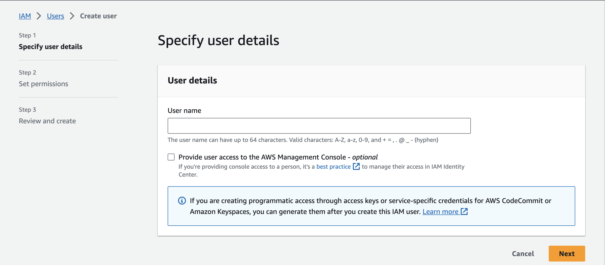
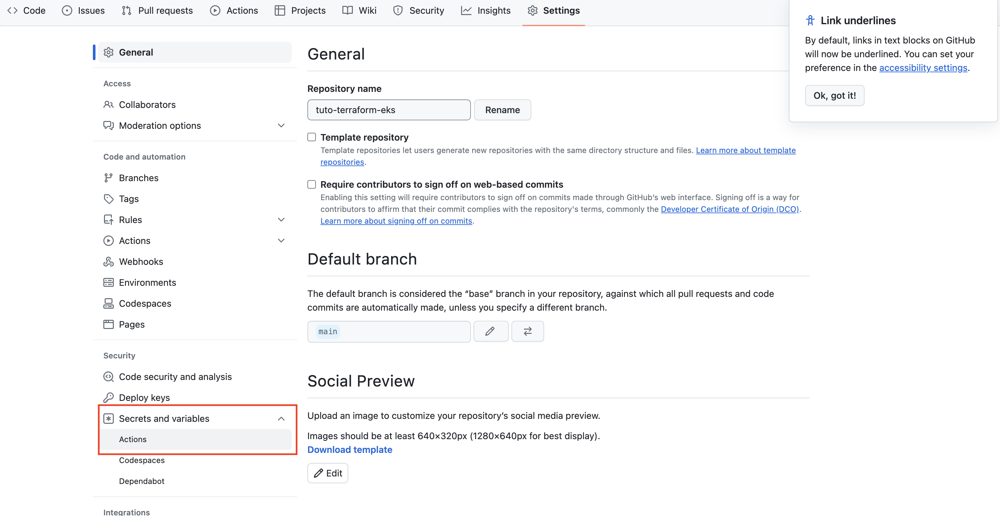
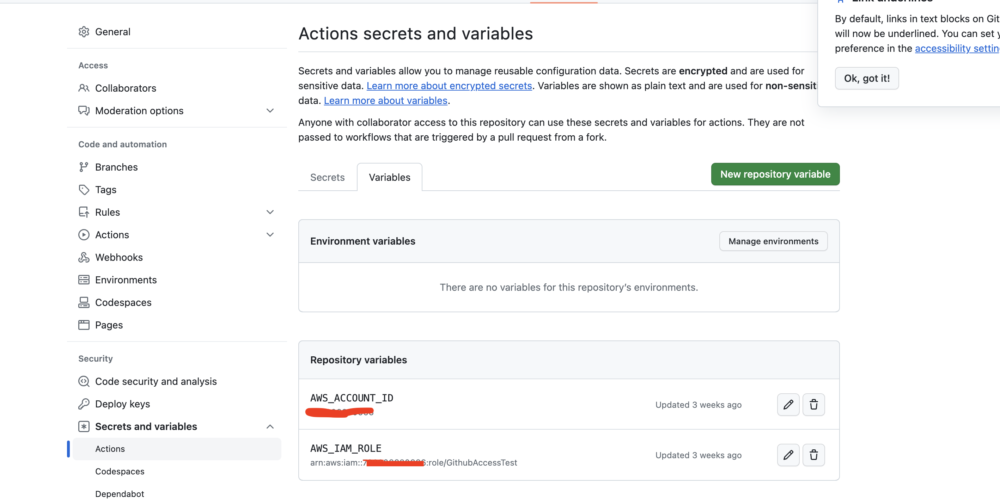
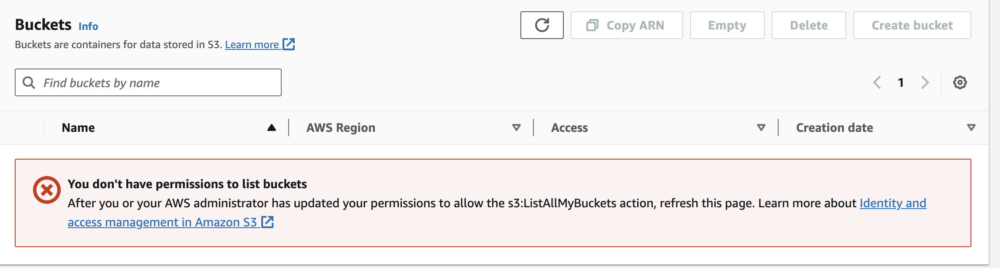
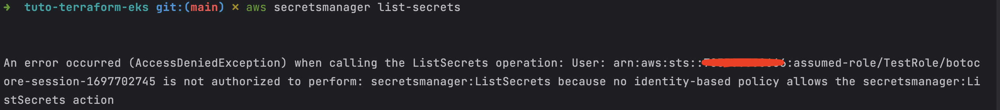

# Tuto IRSA misconfiguration
This repo contains the necessary source code to set up your environment to follow the tutorial.
This contains the script, the cloud formation template, and the example of illegally accessing AWS services. The dangers of EKS irsa misconfigurations in aws.
## local dependency
Make sure you have installed kubectl, terraform and aws cli.
* kubectl on macosx
```shell
brew install kubernetes-cli
```
* terraform on macosx
```shell
brew install terraform
```

* aws cli on macosx
```shell
brew install awscli
```
## Create User with no permissions(can access only to aws console)
[Click here to access to aws console](https://us-east-1.console.aws.amazon.com/iamv2/home?region=us-east-1#/users)

## Execute script set up the readonly user to assume the two roles
Create an access key and secret key for the test only. Copy the access key and secret key to configure aws cli.
Run the following command
```shell
aws configure --profile john-doe
```
## Create the GitHub OIDC(for GitHub actions users)
Use the [github-oidc.yaml](templates/github-oidc.yaml) to create GitHub Actions IAM role. This cloudformation template give a full admin access(Not recommended).
[cloudformation aws console](https://us-east-1.console.aws.amazon.com/cloudformation/home?region=us-east-1)
## Create IAM admin role(for local users)
Use the [admin-role.yaml](templates/admin-role.yaml) to create Admin IAM role that test user will use. This cloudformation template give a full admin access(Not recommended).
[cloudformation aws console](https://us-east-1.console.aws.amazon.com/cloudformation/home?region=us-east-1)
## Create IAM readonly role
Use the [test-role.yaml](templates/test-role.yaml) to create describe eks IAM role that test user will use. This cloudformation template give only access to kubeconfig eks.
[cloudformation aws console](https://us-east-1.console.aws.amazon.com/cloudformation/home?region=us-east-1)
copy and paste the access key type enter. Keep all the remaining as default.
copy and paste the secret key type enter.
## Setup the IAM role for the readonly user
To setup the two IAM role for the readonly user, you need to have python already installed in your environment.
In the script folder you will find the [update-config.py](script/update-config.py) python file.
If the script is not executable please do
```shell
cd script
chmod +x update-config.py
```
Please revisit the [profile.ini](script/profile.ini) file to make sure that all the role information values are good.
If all check please run the script.
```shell
./update-config.py
```
This will auto create all the necessary role for you.
## Update your terraform code accordingly
Make the necessary changes in the [variables file](variables.tf) accordingly. Base on the name you choose for the role 
## Add env variable to gitHub(only if you want to use CI/CD)
Once you fork the code in your space, within the repo click on the setting.
In setting, click on Secrets and variables and then actions.

Once that page is shown then click on variable and add the account id and the GitHub oidc iam role as variables.

## Push to deploy it(GitHub actions users)
Once everything look good then just push to the **main** branch, and then you can observe the pipeline.
The pipeline will create the eks cluster automatically.
## Terraform apply for local users
If you want to use terraform locally instead of the GitHub action, then you can use the AdminTestRole for that.
Export aws profile to be AdminTestRole. Make sure you are in your terraform code repo.
```shell
export AWS_PROFILE=adminTest
```
And then run terraform apply command.
```shell
terraform destroy -var-file=input.tfvars -auto-approve 
```
## create a readonly kubeconfig file
Create a folder call .kube to store your kubeconfig for full Admin access and normal access.
Inside that folder create two file.
```shell
cd .kube
touch admin
touch normal
```
Setup eks kubeconfig for each one of them.
```shell
export KUBECONFIG=`pwd`/admin
aws eks update-kubeconfig --region us-east-1 --name irsa-terraform-eks --alias irsa-terraform-eks --profile adminTest
```
Same for the normal access
```shell
export KUBECONFIG=`pwd`/normal
aws eks update-kubeconfig --region us-east-1 --name irsa-terraform-eks --alias irsa-terraform-eks --profile noAccessTest
```
## Access denied to secret through aws console
Once we visit the aws console as our test user you will see access denied everywhere.

## Access denied to secret through aws cli
Same if we use the **noAccessTest**.
```shell
export AWS_PROFILE=noAccessTest
aws secretsmanager list-secrets
```

## Get database secret through aws pod
Because of bad eks IRSA configuration let's run a pod and attach the service account and steal the database credentials.
For that use the [aws-cli file](sample/aws-cli.yaml) to create a pod.
```shell
kubectl create -f sample/aws-cli.yaml
```
Then we can exec into the pod and alter the database credentials and much more.
```shell
kubectl exec -it <podname> -- /bin/sh
```

